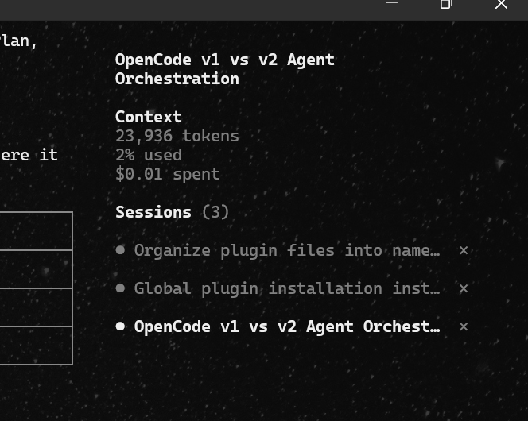

# opencode-sessions-sidebar

[OpenCode](https://opencode.ai) TUI plugin that renders open sessions as a **Sessions** block at the bottom of the sidebar - click a row to switch sessions, `×` to close one - and replaces the built-in top tab strip. Fully reversible: disabling the plugin restores your tab strip.

<div align="center">


<br />


<br />

<a href="https://www.buymeacoffee.com/leogimpel"></a>

</div>

## Install

Add the absolute path to the plugin folder in `~/.config/opencode/tui.json`:

```json
{
  "$schema": "https://opencode.ai/tui.json",
  "plugin": ["C:\\path\\to\\sessions-sidebar"]
}
```

Then quit and restart opencode - TUI config is only read at startup.

To uninstall, remove the entry from `tui.json`. On the next start the plugin's cleanup runs once more and restores the built-in tab strip.

## Features

<div align="center">



</div>

### Sessions block

A live list of open sessions appended to the bottom of the sidebar content area,
above the built-in footer directory indicator:

- One row per session: **status icon + title**, the active session highlighted in bold
- **Click a row to switch** to that session, click **`×`** to remove it from the list
- Closing the active session switches to the next remaining session (or home when the
  list is empty) - the session itself stays in the history, exactly like the old tab strip's close
- Tracks up to **10 sessions**, newest at the bottom; the order is append-only, so rows
  never shuffle while you work
- Session titles persist in the plugin's store, so they survive data eviction

### Status indicators

Each row's icon mirrors the built-in tab strip logic, across the session and its whole
subagent family:

- **Busy** - a dot that gently breathes (smooth cosine pulse) while the agent is
  responding or has pending work; static when the `animations` config is disabled
- **Attention** - a warning-colored triangle when the session has pending
  permissions or questions
- **Idle** - a plain dot otherwise

### Tab strip ownership

While the plugin is enabled it hides the built-in top tab strip by setting
`tabs.enabled: false` in `cli.json` (session tracking moves into the
plugin, because the built-in tab store stops tracking once the strip is disabled):

- The previous value is remembered in plugin storage
- While the plugin is running it **keeps re-asserting** `tabs.enabled: false` by
  watching the config file - plugin cleanup also runs when any OpenCode window
  exits, which would otherwise re-enable the strip in every window that is
  still open
- Disabling or removing the plugin **restores the strip** automatically - if the strip
  was already off before installing, it is left untouched
- `cli.json` is resolved like OpenCode does (`OPENCODE_CONFIG_DIR`, then
  `XDG_CONFIG_HOME`, then `~/.config/opencode`) and is created when missing;
  writes are atomic (temp + rename). If the file cannot be parsed (e.g. JSONC
  comments), a toast asks you to hide the strip manually

## Notes

- The sidebar row width is fixed by opencode's sidebar layout; long titles are clipped
  with a trailing ellipsis.
- `index.ts` is a deliberate no-op so the server-side plugin loader resolves the package
  cleanly without touching TUI-only dependencies - all rendering lives in `tui.tsx`.

## Local development

Point `tui.json` at the repo folder (see [Install](#install)) and restart opencode after
every change - TUI plugins are only loaded at startup.

## Requirements

- opencode **1.18+** (uses the TUI plugin slot API)

## License

MIT
